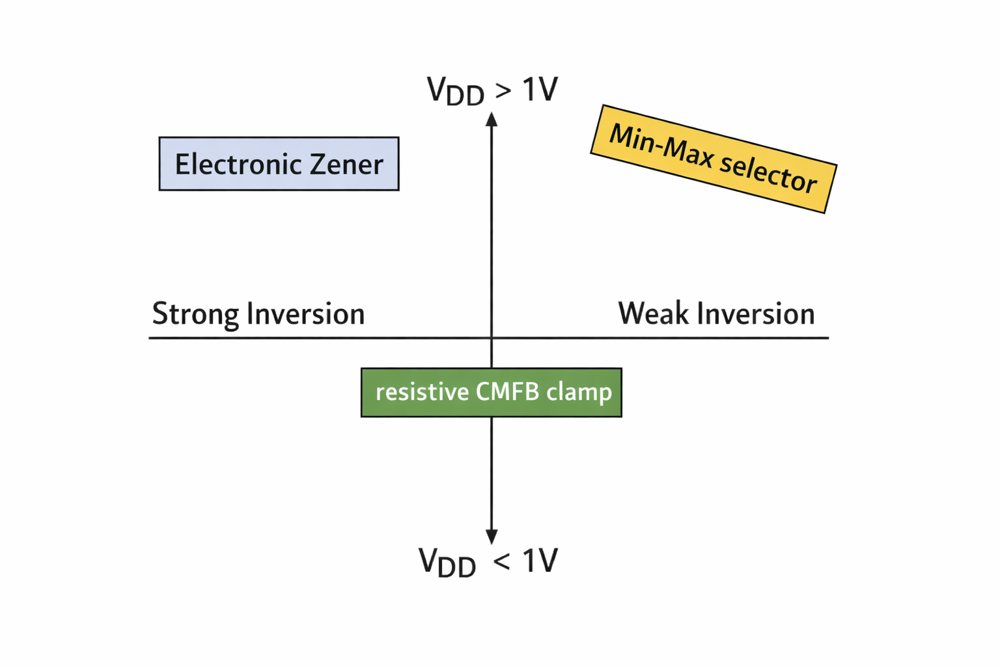

## Abstract

In this open-source reproducible tutorial, we try to understand, simulate and explain some popular choices found in literature survey for design of amplifiers with rail-to-rail input stage under various constraints on supply and region of CMOS operation[@subramanian_119-dba_2025;@li_self-regulated_2020;@chen_multi-form_2025].

## Introduction

The input stage of op-amp may need to tolerate rail-to-rail swing in case of unity feedback configuration under a common mode that swings rail to rail [@subramanian_119-dba_2025]. Usually, there is only a single input pair and the input is directly fed to the gates of this pair. Rail-to-Rail input swing in unity configuration requires one of the following choices:

1. Use of complementary input pairs - a PMOS and an NMOS input pair 
2. Shifting the common-mode of the input fed to a single input pair

{.lightbox}

The first consideration is supply voltage, for supplies below ~1.2V, the use of complementary input pairs becomes infeasible. 
Next, the choice of whether to keep the input pair in strong or weak-inversion affects the gm-variation across input variation. 
Once these two constraints are settled, various creative topologies can be employed competing against each other on following specs:

1. CMRR
2. THD
3. Slew Rate
4. Power burnt
5. UGB variation across input variation

The fundamental relations to be kepy in mind are:

1. In Weak inversion, 
$$
\frac{g_m}{I_D} = \text{Constant}
$$

2. In Strong Inversion,
$$
g_m = \sqrt{2\beta I_D} = \frac{2I_D}{V_{ov}}
$$

---

## Methodology

We have studied a collection of literature reviews on such techniques and have selected few canonical or exotic topologies for simulation in proprietary pdk for our understanding. We have also replicated our learnings on open-source skywater 130nm pdk simulated on colab. You can access details of each topology via the left sidebar. All the colab notebooks are accessible on our github and are simulatable on a single click. We look forward to collaboration and feedback on future extension of this work.

AI was used to generate qualitative plots in this work.

---

## References
